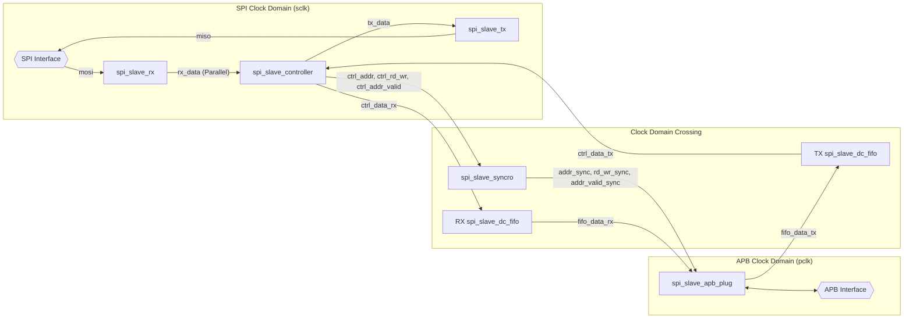
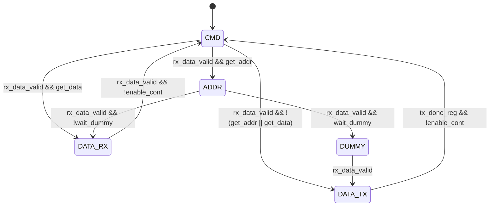

# APB SPI Slave

This document provides a comprehensive overview of the APB SPI Slave IP core, a hardware module that allows an external microcontroller to access a System-on-Chip's (SoC) memory via the SPI protocol. The IP core acts as an SPI slave and an APB master, translating SPI commands into APB bus transactions.

#### 1. Overview

The APB SPI Slave is an IP that bridges the gap between an external SPI master (like a microcontroller) and an internal APB bus. This enables the external master to read from and write to the SoC's memory-mapped peripherals and memory.

This IP is a fork of the `obi_spi_slave` project, adapted for the APB bus protocol.

#### 2. High-Level Architecture

The IP is composed of several interconnected modules, each with a specific role. The top-level module, `apb_spi_slave`, instantiates and connects these components.

Here's a breakdown of the major components and their interactions:

*   **`apb_spi_slave` (Top Module):**
    *   Instantiates all other modules.
    *   Connects the SPI and APB interfaces.
    *   Manages the overall data flow.

*   **`spi_slave_rx` (SPI Receiver):**
    *   Receives serial data (MOSI) from the SPI master.
    *   Deserializes the data into parallel words.
    *   Signals when a full word has been received.

*   **`spi_slave_tx` (SPI Transmitter):**
    *   Receives parallel data from the APB bus (via the controller and FIFO).
    *   Serializes the data and sends it to the SPI master (MISO).
    *   Handles the timing of the MISO signal based on the SPI clock.

*   **`spi_slave_controller` (Main Controller):**
    *   The "brain" of the IP.
    *   Parses commands received from the SPI master.
    *   Manages the state of the SPI communication (e.g., receiving address, data, or sending data).
    *   Interfaces with the `spi_slave_rx` and `spi_slave_tx` modules.
    *   Controls the flow of data to and from the APB bus.

*   **`spi_slave_cmd_parser` (Command Parser):**
    *   Decodes the command byte received from the SPI master.
    *   Determines the type of operation (read/write, memory/register).
    *   Provides control signals to the `spi_slave_controller` based on the decoded command.

*   **`spi_slave_regs` (Register File):**
    *   Contains a set of configurable registers.
    *   These registers control the behavior of the IP, such as:
        *   **Dummy Cycles:** The number of dummy cycles for read operations (the actual value of cycles introduced is the register value + 1).
        *   **Wrap Length:** The max length of burst transfers.
    *   These registers are accessible from the SPI master.

*   **`spi_slave_dc_fifo` (Dual-Clock FIFO):**
    *   Two instances of this module are used: one for the receive path (SPI to APB) and one for the transmit path (APB to SPI).
    *   They provide a safe mechanism for clock domain crossing.

*   **`spi_slave_apb_plug` (APB Master Plug):**
    *   Implements the APB master protocol.
    *   Receives memory access requests from the `spi_slave_controller`.
    *   Generates the necessary APB signals (`psel`, `penable`, `paddr`, `pwrite`, `pwdata`).
    *   Handles the APB `pready` signal for flow control.

*   **`spi_slave_syncro` (Synchronizer):**
    *   Synchronizes signals that cross from the SPI clock domain to the APB clock domain.
    *   This is essential for signals like the chip select (`cs`) and the address valid signal.

#### 3. Protocol and Operation

The communication protocol is based on a set of commands sent by the SPI master. Each command is a single byte, followed by an optional address and data.

**3.1. SPI Commands:**

The following commands are supported:

| Command | Value | Description |
| :--- | :--- | :--- |
| `write_mem` | `8'h02` | Write to memory. Followed by address and data. |
| `read_mem` | `8'h0B` | Read from memory. Followed by a address. |
| `read_reg0` | `8'h07` | Read from register 0 (dummy cycles). |
| `write_reg0` | `8'h11` | Write to register 0 (dummy cycles). |
| `write_reg1` | `8'h20` | Write to register 1 (wrap length, low). |
| `read_reg1` | `8'h21` | Read from register 1 (wrap length, low). |
| `write_reg2` | `8'h30` | Write to register 2 (wrap length, high). |
| `read_reg2` | `8'h31` | Read from register 2 (wrap length, high). |

**3.2. Write Operation (`write_mem`):**

1.  The SPI master asserts the chip select (`cs`) line (active low).
2.  The master sends the `write_mem` command (`8'h02`).
3.  The master sends the address.
4.  The master sends the data.
5.  The `spi_slave_controller` receives the command, address, and data.
6.  The data is written to the receive FIFO.
7.  The `spi_slave_apb_plug` reads the data from the FIFO and initiates an APB write transaction to the specified address.
8.  The master can continue to send data for burst writes. The address will be incremented automatically.
9.  The master de-asserts the `cs` line to end the transaction.

**3.3. Read Operation (`read_mem`):**

1.  The SPI master asserts the `cs` line.
2.  The master sends the `read_mem` command (`8'h0B`).
3.  The master sends the address.
4.  The `spi_slave_controller` receives the command and address.
5.  The `spi_slave_apb_plug` initiates an APB read transaction to the specified address.
6.  The master sends a number of dummy cycles (configurable via `reg0`). During this time, the APB read is being performed.
7.  The read data is placed in the transmit FIFO.
8.  The `spi_slave_tx` module reads the data from the FIFO and sends it to the master on the MISO line.
9.  The master can continue to clock the SPI to receive more data for burst reads.
10. The master de-asserts the `cs` line to end the transaction.

**3.4. Register Access:**

Accessing the internal registers is similar to memory access, but with the dedicated register access commands. These operations are typically used to configure the IP before performing memory transfers.

#### 4. Configuration

The IP has several parameters that can be configured at instantiation time:

*   `APB_ADDR_WIDTH`: The width of the APB address bus.
*   `APB_DATA_WIDTH`: The width of the APB data bus.
*   `SPI_MODE`: The SPI mode (0 or 1).
*   `READ_DUMMY_CYCLES`: The default number of dummy cycles for read operations (7 by default, meaning 8 extra cycles).

The number of dummy cycles and the wrap length can also be configured at runtime by writing to the internal registers.

#### 5. Spi Slave Controller FSM diagram 

#### 6. Synthesis suggestions

    [TODO]
